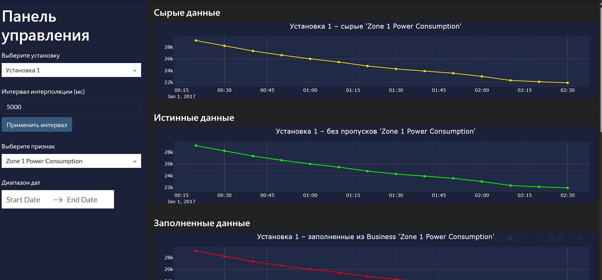

# RestoringValues
**RestoringValues** — это проект на Python, предназначенный для восстановления пропущенных значений с датчиков технологической установки (например, показаний энергопотребления, температуры, влажности и др.). Система имитирует поток датчиков с выпадением данных и применяет алгоритмы заполнения пропусков (импутации) для восстановления потерянной информации. В режиме реального времени результаты сохраняются и отображаются на интерактивном дашборде. Визуализация реализована с помощью фреймворка Dash (Plotly) для веб-интерфейса мониторинга данных.

## Цель проекта
Целью проекта является разработка системы для **восстановления пропущенных данных** датчиков технологической установки. Это позволяет поддерживать целостность и непрерывность временных рядов измерений (энергопотребление, температура, влажность и пр.), даже если некоторые значения были утеряны или не поступили от оборудования. Для более подробного ознакомления с проектом в репозитории находится [техническое задание](Техническое_задание.pdf).

## Компоненты проекта
Проект структурирован на несколько модулей, каждый из которых отвечает за свою часть процесса обработки данных:

  * **Simulator** (Simulator/simulator.py) — модуль симуляции, генерирует поток данных от установки. Имитирует работу двух условных установок: читает исходные данные из файлов, добавляет пропуски с заданной вероятностью и передает результаты на несколько портов по протоколу WebSocket. _Примечание:_ модуль запускает вспомогательный сервер (server_web.py) для обслуживания WebSocket-соединений.
  * **Reciever** (Reciever/reciever.py) — модуль сбора данных. Подключается к WebSocket-портам, открытым симулятором, принимает поступающие сообщения с показаниями. Данные накапливаются в буферах и периодически сохраняются в CSV-файлы (например, data_port_<порт>.csv) для последующей обработки. Таким образом формируется набор сырых данных с пропущенными значениями.
  * **Business** (Business/business.py) — модуль восстановления значений и расчета метрик. Периодически читает свежие данные из CSV, заполненные Reciever-ом, и выполняет импутацию пропущенных значений с помощью специального алгоритма (например, KNN по временному признаку). Результаты работы сохраняются в новые CSV-файлы (например, data_out_<порт>.csv с восстановленными значениями). Если для датчика имеется “эталонный” поток без пропусков (тестовые данные), модуль рассчитывает метрики качества восстановления (в частности, MAPE – среднюю абсолютную процентную ошибку) и сохраняет их в файл (data_metrics_<порт>.csv). Логи работы выводят основные показатели и успешность заполнения.
  * **Dash-приложение** (GUI/dash_app.py) — модуль визуализации результатов. Веб-приложение на базе Dash отслеживает обновления CSV-файлов и отображает данные в виде интерактивного дашборда. На графических компонентах можно наблюдать исходные поступающие данные, восстановленные значения, а также показатели качества (ошибки), обновляющиеся в режиме реального времени. Запущенное приложение поднимает локальный веб-сервер и предоставляет пользовательский интерфейс мониторинга через браузер.

## Установка

Для запуска проекта убедитесь, что у вас установлен Python 3.x (рекомендуется версия 3.10 или выше). Выполните следующие шаги для установки приложения:

  1. **Клонирование репозитория**: склонируйте код проекта из GitHub:
```
git clone https:https://github.com/addrree/RestoringValues.git
cd RestoringValues
```

  2. **Установка зависимостей**: установите необходимые пакеты Python. В репозитории присутствует файл [requirements.txt](requirements.txt), выполните команду:
```
pip install -r requirements.txt
```
## Запуск проекта

После успешной установки компонентов запустите модули в **отдельных** терминалах в указанном порядке (каждый модуль работает как самостоятельный процесс):
  1. **Simulator**: запустите модуль симуляции данных командой python Simulator/simulator.py. Он начнёт эмитировать данные двух виртуальных датчиков и передавать их через WebSocket-соединения на порты (по умолчанию используются порты 8092, 8093, 8094, 8095). В консоли будут отображаться сообщения о ходе симуляции.
  2. **Reciever**: в другом терминале выполните python Reciever/reciever.py. Этот модуль подключится к указанным WebSocket-портам (8092–8095), будет получать от них данные и сохранять их в CSV-файлы в папке Reciever (например, data_port_8092.csv, data_port_8094.csv). В консоли приложения отображаются логи приёма данных и операции записи файлов.
  3. **Business**: далее запустите модуль восстановления значений python Business/business.py. Он начнёт периодически считывать новые данные из CSV, заполнять пропуски алгоритмом KNN и сохранять результаты в файлы в папке Business (например, восстановленные данные data_out_8092.csv). Если параллельно поступают контрольные данные без пропусков (со вторых портов каждой установки), модуль вычислит метрики точности восстановления и сохранит их (файлы data_metrics_*.csv). Консольный вывод данного модуля будет содержать информацию о каждом заполненном пакете и рассчитанных метриках (MAPE и др.), сопровождаемую уведомлениями об успешном завершении каждой итерации.
  4. **Dash-приложение штатный режим**: после подготовки вышеуказанных сервисов, выполните команду python GUI/dash_app_prod.py для запуска веб-интерфейса. Приложение Dash развернет локальный сервер (по умолчанию 0.0.0.0:8051). Чтобы увидеть дашборд, откройте браузер и перейдите по адресу http://localhost:8051. На странице отобразятся графики и таблицы, демонстрирующие поступающие сырые данные и результаты восстановления. Дашборд обновляется автоматически по мере появления новых данных и вычисленных значений.
  5. **Dash-приложение тестовый режим (необязательный пункт)**: после подготовки вышеуказанных сервисов, выполните команду python GUI/dash_app_test.py для запуска веб-интерфейса. Приложение Dash развернет локальный сервер (по умолчанию 0.0.0.0:8050). Чтобы увидеть дашборд, откройте браузер и перейдите по адресу http://localhost:8050. На странице отобразятся графики и таблицы, демонстрирующие поступающие сырые данные и результаты восстановления. Дашборд обновляется автоматически по мере появления новых данных и вычисленных значений. Отличие от штатного режима в том, что будут присутствовать метрики качества восстановления.

 

_Примечание: Рекомендуемый порядок запуска – **Simulator** → **Reciever** → **Business** → **Dash_app**_

## Пример работы запущенного проекта



## Структура проекта

Ниже представлена структура файлов и каталогов в репозитории:
```
RestoringValuesSPbPU/
├── Business/
│   ├── business.py          # Запуск цикла восстановления пропусков и расчёта метрик
│   ├── data_source.py       # Класс источника данных (чтение исходных CSV, запись результатов)
│   └── model.py             # Реализация алгоритма KNN и вычисление метрик качества
├── Reciever/
│   ├── reciever.py          # Асинхронный сбор данных через WebSocket и сохранение в CSV
│   ├── data_port_8092.csv   # Пример собранных данных (CSV с пропусками) для порта 8092
│   └── data_port_8094.csv   # Пример собранных данных (CSV с пропусками) для порта 8094
├── Simulator/
│   ├── simulator.py         # Скрипт симуляции датчиков; запускает server_web и поток данных
│   ├── server_web.py        # WebSocket-сервер для передачи данных (запускается Simulator-ом)
│   └── websocket_scanner.py # Утилита для отладки: подключение к WebSocket и вывод полученных данных
├── GUI/
│   ├── dash_app_prod.py     # Dash-приложение для визуализации данных и результатов в штатном режиме
│   └── dash_app_test.py     # Dash-приложение для визуализации данных и результатов в тестовом режиме   
└── README.md                # Описание проекта (настоящий файл)
```
## Авторы
 * Ильин Андрей Александрович 
 * Кококов Амир Айдарович
 * Коган Станислав Константинович 
 * Бакастов Иван Андреевич
 * Селищев Роман Александрович 
 * Алексенцев Никита Владимирович 
